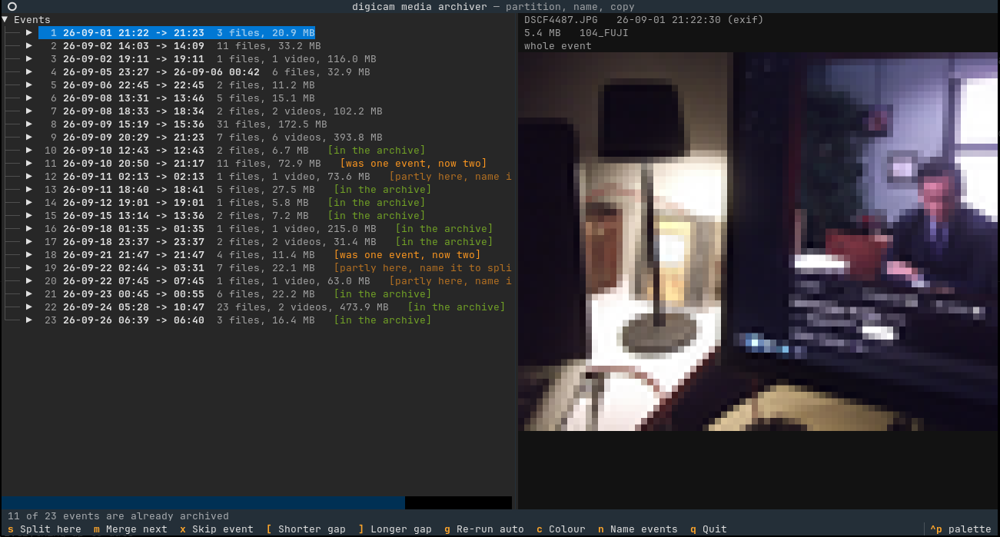
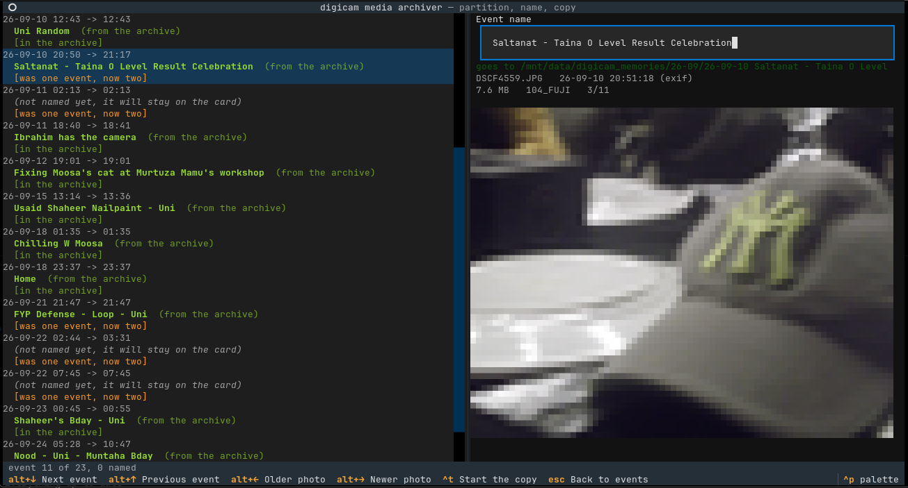

# digicam-media-archiver

A lightweight command line tool to sort and structure photos by event. Read a digicam card (or any folder of JPG and AVI dumps), work out which shots
belong together using timestamps, name each group, then copy them into an archive and turn the AVI clips into MP4 using HandBrake.

Nothing on the card is ever moved, renamed or deleted. Everything the tool
produces goes into a new file in the archive, and a run that stops half way can
be repeated: files that are already in place are skipped.

## Screenshots




## What you need

- Python 3.11 or newer
- `ffmpeg` and `ffprobe` on `PATH` for the video previews (photos need neither)
- `HandBrakeCLI` for the conversion, optional but you will want it:
  `sudo pacman -S handbrake-cli`

## Install

```sh
python3 -m venv .venv
.venv/bin/python -m pip install -e .
```

## Run

```sh
.venv/bin/digicam-archiver ~/pics/card-2026-08-23
```

The source can be the card mount that holds `DCIM`, or any folder inside it.
To see the grouping without touching anything:

```sh
.venv/bin/digicam-archiver ~/pics/card-2026-08-23 --print-plan
```

Useful flags:

| flag | what it does |
| --- | --- |
| `-a, --archive DIR` | where the archive lives, asked for later if left out |
| `-g, --gap 4h` | silence that starts a new event, `90m` and `1h30m` work too |
| `-p, --preset NAME` | HandBrake preset, default `Fast 720p30` |
| `--handbrake PATH` | use a HandBrakeCLI that is not on `PATH` |
| `--faststart` | move the mp4 index to the front so it streams |
| `--overwrite` | copy and convert again even when the file is already there |
| `--checksum` | compare sha256 of every copied photo, slow but certain |
| `--no-adopt` | ignore what the archive holds, every event gets a fresh folder |
| `--strict` | never move files the archive already holds; exit `2` if it would have to |
| `--print-plan` | print the partitioning, and the rerun report with `-a`, then exit |
| `--dry-run` | walk through the interface, stop before copying |
| `--ascii` | plain preview instead of colour, for dull terminals |

## Running the same card twice

Point the tool at a card you have archived before and it works out what it has
already done. With `-a DIR`, `--print-plan` says so in text:

```sh
.venv/bin/digicam-archiver ~/pics/card-2026-08-23 -a ~/archive --print-plan
```

```
archive /home/you/archive: 12 event folder(s)
  Sun 23.08.2026 14:02  partial 26-08-23 Uni Friends Hangout, 3 of 4 there
  Mon 24.08.2026 10:00  new, nothing there
  the archive would change:
    move DSCF0004.JPG: 26-08-23 Uni Friends Hangout -> 26-08-24 Second day
```

In the interface the first screen asks for the archive before anything else and
marks each event:

| mark | what it means |
| --- | --- |
| `[in the archive]` | every file of this event is already there, nothing gets copied |
| `[partly there]` | some files are missing and will be copied |
| `[was one event, now two]` | you split an event that is already archived |
| `[was two events, now one]` | you merged two of them |

The past events sit above the new ones in the list, so on a rerun you can go
straight to the first new event and press `alt+x`: every event before the cursor
is skipped, the ones that were already copied, and they never reach naming or
the copy. Pressing it again changes nothing — `x` is the key that puts a
single event back.
| `[which folder is this?]` | a folder holds files the card cannot explain, so it stops and asks |

The naming screen offers the name the archive already uses, and you can type a
different one. Events you leave unnamed stay on the card, which is the point:
nothing is written for them.

How a match is decided, in order:

- a photo matches an archived photo of the same size and mtime, and failing
  that the same size and the first 16 KiB of the file
- a video matches an archived `.mp4` with the same stem, so `DSCF0003.AVI`
  finds `DSCF0003.mp4`
- no manifest file is written anywhere; the archive is only ever read

Splitting or merging an event that is already archived means moving files that
are already filed. The run shows every move first, and only does it when you
say so:

```
move DSCF0004.JPG: 26-08-23 Uni Friends Hangout -> 26-08-24 Second day
rename 26-08-23 Uni Friends Hangout -> 26-08-23 Uni Friends
remove 26-08-23 Uni Friends Hangout if it ends up empty
```

Nothing is deleted: a file only ever leaves a folder because it moved into
another one, a folder is removed only when `rmdir` finds it empty, and each run
that changes the archive writes what it did to `DIR/.digicam/changes-*.json`.

If a folder holds files that no event of this card accounts for, the run stops
and asks instead of guessing, and it never touches those files.

`--strict` is the same instinct for scripts: it turns the moves down instead of
asking, so the archive is only ever added to, never rearranged. Media that the
archive already holds under a different name is left where it is rather than
copied in again, and the run ends with exit code `2` to say it did not do what
the plan asked.

## The three screens

### 1. Events

The left side lists the events the tool worked out, one line each, with the
file count, the size and any name you already gave it. The right side shows the
highlighted shot as ASCII art, or a still from the video. Videos are drawn from
a frame about a fifth of the way in.

The preview decodes in the background, one shot at a time, and a shot that has
moved off the screen before it was finished is thrown away, so holding an arrow
key never queues up work. The next event's first shot is warmed up while you
read the current one, which is why moving down the list feels instant.

| key | action |
| --- | --- |
| `up` `down` / `k` `j` | move |
| `right` / `left` | open an event to see its files, or close it again |
| `shift+left` / `shift+right` | scroll a too-wide list sideways (the arrow keys never stop opening events) |
| `s` | split before the highlighted file |
| `m` | merge this event with the next one |
| `x` | leave this event out of the run, press again to put it back |
| `alt+x` | skip every event before the cursor in one go, the already-done ones on a rerun; they stay out, `x` puts a single one back |
| `[` `]` | shorter or longer gap, 15 minutes at a time |
| `g` | forget the manual splits and regroup with the current gap |
| `c` | colour or plain preview |
| `n` | go on to naming |
| `q` | quit |

`g` throws away the manual calls, so change the gap first and press `g` when a
card needs a different shape.

### 2. Names

Every event needs a name before anything is copied. The field is prefilled with
the date, so typing over it is one keystroke.

| key | action |
| --- | --- |
| `alt+down` / `alt+up` | next or previous event (`ctrl+n` also goes down) |
| `alt+x` | skip every event before this one, they drop out of the list and stay out |
| `alt+left` / `alt+right` | older or newer photo in this event |
| `pageup` / `pagedown` | the same, for keyboards without working alt keys |
| `alt+home` / `alt+end` | first or last photo of the event |
| `ctrl+s` | save the name you typed |
| `ctrl+t` | start the copy |
| `escape` | back to the events |
| `q` | quit |

The photo keys walk through every file of the highlighted event, videos
included, so you can check what actually landed in a group before naming it. The
line under the field shows the folder the event will land in, and the second
line of the preview shows which photo you are on, like `3/42`. A second event
with the same date gets its own folder, never a merge.

`ctrl+p` is the command palette, so it is not a shortcut here.

### 3. Copy and convert

| key | action |
| --- | --- |
| `escape` | stop after the file in flight, then `r` to finish the rest |
| `r` | run again, for the files left behind |
| `q` | quit |

Photos are copied in 1 MB chunks through a `.part` file, so an interrupted copy
never leaves a half written photo in the archive. Videos are converted to MP4
with HandBrake, which is slow, so the screen shows a per file bar, an overall
bar, the remaining time and a log of what happened.

If HandBrakeCLI is missing the run still goes ahead, the photos are copied and
the videos are counted as left for later.

When an event folder is already in the archive the run asks: add to it, skip the
event, give it a new name, or cancel the run. Files that are already there are
skipped unless `--overwrite` is given, and a name clash gets a `_1`, `_2` suffix
so nothing is overwritten by accident.

## How the timestamps work

- JPG: `DateTimeOriginal` from the EXIF block, the file's mtime when it has none
- AVI: the file's mtime, that is when the digicam wrote it
- events: a file that starts more than `--gap` after the one before it opens a
  new event

All times are local camera time, no timezone is assumed.

## The archive

```
archive/26-08/26-08-23 Uni Friends Hangout/DSCF0001.JPG
archive/26-08/26-08-23 Uni Friends Hangout/DSCF0001_1.JPG
archive/26-08/26-08-23 Uni Friends Hangout/DSCF0003.mp4
```

The month and the day come from the first shot of the event, so a night out that
runs past midnight stays together. The names from two folders that held the same
camera filenames (`103_FUJI` and `104_FUJI`, say) get a suffix instead of
overwriting each other. `.THM` thumbnails and other formats are ignored.

Reading the archive to match events means hashing the first 16 KiB of every
archived photo that could be a match, which is why the first screen says
`reading the archive` for a moment on a big archive. It happens once per run;
`--no-adopt` skips it entirely and keeps the old behaviour of asking before
writing into a folder that is already there.

## Tests

```sh
.venv/bin/python -m pytest            # everything
.venv/bin/python -m pytest -m "not ui" # skip the headless interface tests
.venv/bin/ruff check src tests
```

The tests write real JPEGs and a real little AVI with ffmpeg into a temporary
folder, and fake `HandBrakeCLI` scripts stand in for the encoder, so nothing
outside `tmp_path` is touched and no encoder is needed. The `ui` marked tests
drive the Textual interface headless with a virtual keyboard, cursor and all.
